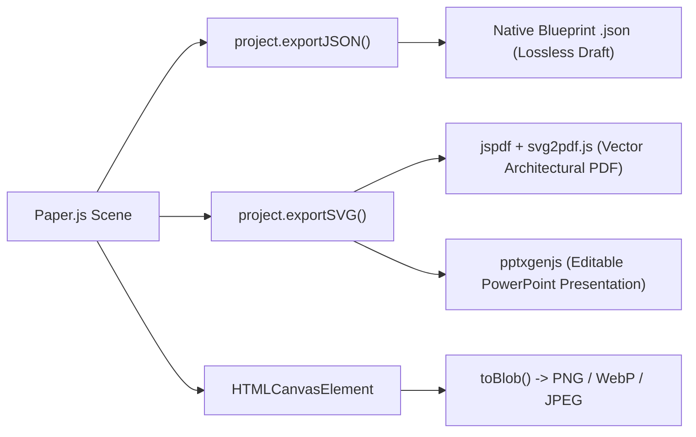

# Blueprint: Interactive 2D Vector CAD & Industrial Layout Canvas

> [!abstract] Manifest & Architectural Specification
> **Blueprint** is an extensible, interactive 2D vector canvas plugin for **rune-lab** (and standalone Svelte 5 applications) designed for architectural, technical, and industrial spatial layouts. Inspired by the fluidity of Excalidraw, but engineered with vector precision, hierarchical CAD layers, mock device libraries, and multi-format exports.

---

## 1. Vision & Core Objectives

Traditional whiteboard tools (like Excalidraw or tldraw) treat canvases as flat scratchpads of freehand doodles and sticky notes. Engineering, manufacturing, and logistics domains, however, require:
1. **Hierarchical CAD Layers:** Logical separation between civil structural elements, functional zones, active equipment, and annotations.
2. **Industrial Domain Modeling:** Dedicated device entities (e.g. CNC mills, conveyor belts, sensors) backed by structured schemas and live telemetry mock data.
3. **Dual-Mode Operation:**
   - **Editor Mode:** Full drafting tools, transform gizmos, snapping, layer controls, and history.
   - **Preview Mode:** Locked, read-only interactive viewer that can be embedded as a **live digital twin background** or operational dashboard in other applications.
4. **Professional Multi-Format Export:** Lossless vector export to **JSON**, **SVG**, **PNG/WebP**, architectural **PDF** (with vector layers), and editable **PPTX** presentation slides.

---

## 2. Flagship Domain Example: The "Nave Industrial" (Smart Factory)

The reference implementation and primary mental model for Blueprint is a modern **Nave Industrial** (industrial manufacturing plant / warehouse):

```
┌────────────────────────────────────────────────────────────────────────────────────────┐
│ [LAYER: MARKS]         [Dim: 60.00m] ◄────────────────────────────────► [Dim: 60.00m]   │
│                                                                                        │
│ [LAYER: FOUNDATION]    ┌─────────────────────────────────────────────────────────────┐ │
│ Perimeter Walls,       │ [Dock Door 1]   [Dock Door 2]                 [Staff Entry] │ │
│ Columns & Slab         │ ═════════════   ═════════════                 ═════════════ │ │
│                        │                                                             │ │
│ [LAYER: SECTIONS]      │ ┌─────────────────────────┐   ┌───────────────────────────┐ │ │
│ Functional Zones       │ │ ZONE A: Raw Material    │   │ ZONE B: Automated Assembly│ │ │
│ & Corridors            │ │ [Storage Bay Racks]     │   │                           │ │
│                        │ │                         │   │   [Robotic Arm Cell #1]   │ │
│ [LAYER: MACHINERY]     │ └─────────────────────────┘   │             │             │ │
│ Devices, Equipment,    │             │                 │             ▼             │ │
│ Telemetry & Sensors    │     [AGV Pathway] ══════════════► [Conveyor Belt System]  │ │
│                        │             │                 │             │             │ │
│                        │             ▼                 │             ▼             │ │
│                        │ ┌─────────────────────────┐   │   [5-Axis CNC Mill #04]   │ │
│                        │ │ ZONE C: Quality Control │   │                           │ │
│                        │ │ [IoT Temp/Vibe Node]    │   └───────────────────────────┘ │ │
│                        │ └─────────────────────────┘                                 │ │
│                        └─────────────────────────────────────────────────────────────┘ │
└────────────────────────────────────────────────────────────────────────────────────────┘
```

### The 4-Layer Hierarchy

Blueprint organizes the scene into 4 dedicated, independently controllable layers:

```mermaid
graph TD
    Root[Paper.js Project Scenegraph] --> L4[Layer 4: Marks & Dimensions]
    Root --> L3[Layer 3: Machinery & Devices]
    Root --> L2[Layer 2: Sections & Zones]
    Root --> L1[Layer 1: Foundation & Grid]

    L4 --> M1[Dimension Callouts & Arrows]
    L4 --> M2[Safety & Evacuation Signs]
    L4 --> M3[Status Badges & Warning Tags]

    L3 --> D1[5-Axis CNC Milling Centers]
    L3 --> D2[Automated Conveyor Paths]
    L3 --> D3[Robotic Arm Welding Cells]
    L3 --> D4[IoT Sensor Nodes - Temp / Vibration]

    L2 --> Z1[Raw Material Storage Bay]
    L2 --> Z2[Production & Assembly Zone]
    L2 --> Z3[Hazardous Material Quarantine]
    L2 --> Z4[Pedestrian Walkways & Forklift Aisles]

    L1 --> F1[Perimeter Concrete Walls]
    L1 --> F2[Loading Dock Levelers & Roller Doors]
    L1 --> F3[Structural Pillar Grid 10m x 10m]
    L1 --> F4[Floor CAD Blueprint & Measurement Grid]
```



#### Layer Details

| Layer ID | Name | Role & Contents | Default Behaviors |
| :--- | :--- | :--- | :--- |
| `foundation` | **Foundation & Structure** | Outer walls, load-bearing columns, dock doors, fire exits, architectural grid. | Locked by default during equipment arrangement. Boolean path cuts applied here (e.g. subtracting door openings from walls). |
| `sections` | **Sections & Zones** | Functional polygons representing warehouse zones, safety perimeters, hazard areas, pedestrian aisles. | Semi-transparent fills (opacity 0.2 - 0.4), color-coded by safety class (green: transit, yellow: storage, red: hazardous). |
| `machinery` | **Machinery & Devices** | Physical industrial equipment (CNCs, conveyors, robotic cells, racks, sensors). | Backed by `DeviceSchema` with mock data (status, power consumption, telemetry). Selectable, draggable, rotatable. |
| `marks` | **Marks & Dimensions** | Dimension lines, distance annotations, warning markers, inspection pins, maintenance tags. | Scales dynamically with viewport zoom; non-printable toggle available. |

---

## 3. The Two Operating Modes

### Mode 1: Editor Mode (`mode = 'editor'`)
- **Primary Use:** Floorplan drafting, equipment placement, spatial planning.
- **UI Elements:**
  - Workspace tool strip enabled (Select, Pan, Wall Cutter, Zone Drawer, Device Placer, Dimension Tool).
  - Transform gizmos active on selected items (bounding box with 8 resize handles + rotation stem).
  - Drag-and-drop enabled from the Device Library sidebar onto the canvas.
  - Snapping system active (grid snapping, wall alignment guides, angle constraints).
  - Full Undo / Redo history tracking.

### Mode 2: Preview Mode (`mode = 'preview'`)
- **Primary Use:** Read-only presentation, operational supervision, digital twin dashboard background.
- **UI Elements:**
  - All drafting tools, selection outlines, and transform gizmos are **completely hidden**.
  - Canvas editing events are disconnected; items cannot be moved or deleted.
  - Viewport navigation (smooth pan and pinch-to-zoom) remains optionally interactive.
  - **Interactive Hover Telemetry:** Hovering over a machinery item displays a non-intrusive DaisyUI card with real-time or mock telemetry (e.g. *"CNC-04: Running at 84% load, 62°C, 3.2 kW"*).
  - Can be embedded directly as a background component `<BlueprintViewer doc={naveIndustrialJson} />` behind other application dashboards.

---

## 4. Multi-Format Export Engine

Blueprint implements a multi-format exporter:



1. **JSON (`.blueprint.json`):** Lossless native document format containing full Paper.js scenegraph data, custom metadata, and layer assignments.
2. **SVG (`.svg`):** Scalable vector standard containing clean grouped paths and text.
3. **Images (`.png`, `.webp`):** High-resolution raster snapshots rendered directly from the canvas for reports and thumbnails.
4. **PDF (`.pdf`):** Scalable vector architectural sheet generated via `jspdf` and `svg2pdf.js`, retaining vector fidelity at any zoom level.
5. **PPTX (`.pptx`):** Generates executive PowerPoint decks via `pptxgenjs` by mapping vector shapes and groups into native presentation slides.

---

## 5. Technology Stack & Architectural Decisions

| Concern | Selected Solution | Reason for Selection |
| :--- | :--- | :--- |
| **Vector Drawing Engine** | **Paper.js** (`paper@0.12.18`) | Native scenegraph hierarchy (`Project` -> `Layer` -> `Group` -> `Item`), exact Bézier math, boolean operations (`unite`, `subtract`), and native JSON/SVG I/O. |
| **Tool State Machine** | **XState v5** (`xstate@5.19+`) or `runed` FSM | Eliminates "boolean flag soup" during pointer drag/draw lifecycles; strictly isolates Editor vs. Preview transitions. |
| **Document History (Undo/Redo)** | Svelte 5 Runes `CanvasHistory` class | Lightweight (under 30 LOC) snapshot stack leveraging `project.exportJSON()`; zero React baggage. |
| **Device & Document Schemas** | **Valibot** (`valibot`) | Modular, lightweight (<1 KB) schema validation for mock devices and save files. |
| **Application Shell & UI** | **rune-lab** (`rune-lab/layout`) | 5-zone workspace (`WorkspaceLayout`), DaisyUI v5 themes, and Effect-backed kernel dependency injection. |
| **PDF Generation** | `jspdf` + `svg2pdf.js` | Direct SVG-to-vector PDF translation in browser memory. |
| **PPTX Generation** | `pptxgenjs` | Client-side PowerPoint slide synthesis with native vector shape support. |

---

## 6. Rune-Lab UI Layout Integration

Blueprint integrates seamlessly as a plugin in `src/packages/plugins/blueprint`:

```
┌─────────────────────────────────────────────────────────────────────────────────────────────┐
│ Header: File Menu (New, Save, Open) | Mode Toggle [Preview / Edit] | Undo / Redo | Export ▾ │
├───────┬─────────────────────────────┬────────────────────────────────────────┬──────────────┤
│ Strip │ Navigation Panel (Left)     │ Main Content (Center)                  │ Detail Panel │
│       │                             │                                        │ (Right)      │
│ [ ↖ ] │ ── Layers ───────────────── │ ┌────────────────────────────────────┐ │ ── Inspector ─│
│ Select│ [👁 🔒] Marks               │ │                                    │ │ Layer: Mach. │
│       │ [👁 🔓] Machinery (Active)  │ │         Paper.js Canvas            │ │ X: 240.5 m   │
│ [ ⮑ ] │ [👁 🔒] Sections            │ │         (Pan / Zoom Viewport)      │ │ Y: 110.0 m   │
│ Wall  │ [👁 🔒] Foundation          │ │                                    │ │ Rot: 90°     │
│       │                             │ │                                    │ │ W: 4.5m H:2m │
│ [ ▢ ] │ ── Device Library ───────── │ │                                    │ │              │
│ Zone  │ • [Icon] 5-Axis CNC Mill    │ │                                    │ │ ── Telemetry ─│
│       │ • [Icon] Robotic Arm Cell   │ │                                    │ │ Status: OK   │
│ [ ⚙ ] │ • [Icon] Conveyor Segment   │ │                                    │ │ Power: 3.2kW │
│ Device│ • [Icon] Storage Rack       │ │                                    │ │ Temp: 62 °C  │
│       │ • [Icon] IoT Sensor Node    │ └────────────────────────────────────┘ │ Maint: In 14d│
└───────┴─────────────────────────────┴────────────────────────────────────────┴──────────────┘
```
